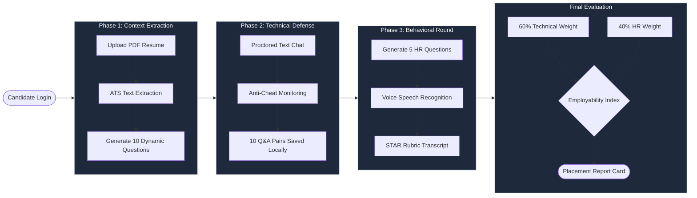

```mermaid
flowchart LR
    Start([Candidate Login]) --> P1
    
    subgraph P1 [Phase 1: Context Extraction]
        A[Upload PDF Resume] --> B[ATS Text Extraction]
        B --> C[Generate 10 Dynamic Questions]
    end
    
    P1 --> P2
    
    subgraph P2 [Phase 2: Technical Defense]
        D[Proctored Text Chat] --> E[Anti-Cheat Monitoring]
        E --> F[10 Q&A Pairs Saved Locally]
    end
    
    P2 --> P3
    
    subgraph P3 [Phase 3: Behavioral Round]
        G[Generate 5 HR Questions] --> H[Voice Speech Recognition]
        H --> I[STAR Rubric Transcript]
    end
    
    P3 --> Final
    
    subgraph Final [Final Evaluation]
        J[60% Technical Weight] & K[40% HR Weight] --> L{Employability Index}
        L --> M([Placement Report Card])
    end

    classDef phase fill:#1e293b,stroke:#cbd5e1,stroke-width:1px,color:#fff;
    class P1,P2,P3,Final phase;
```
