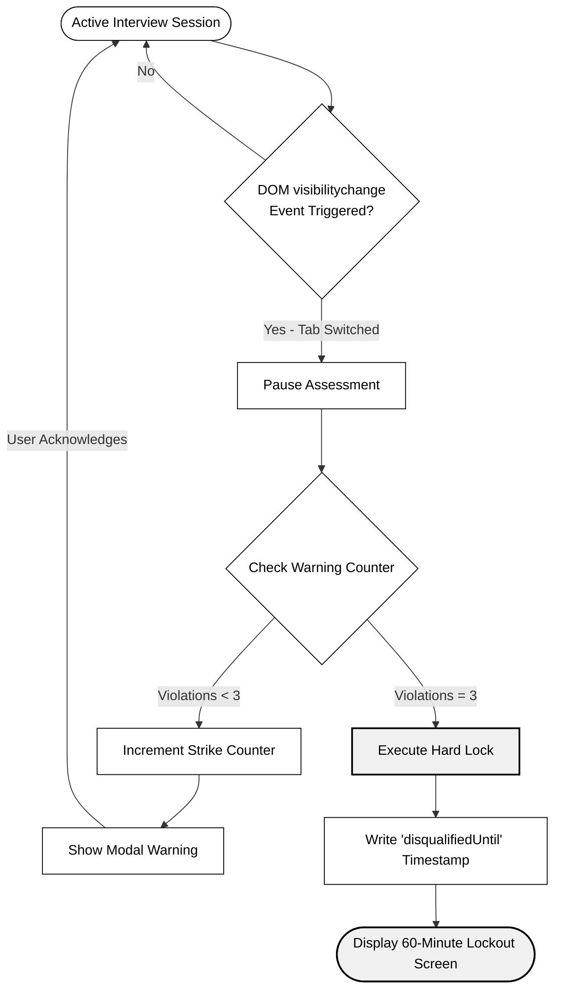

```mermaid
flowchart TD
    A([Active Interview Session]) --> B{DOM visibilitychange\nEvent Triggered?}
    B -->|No| A
    B -->|Yes - Tab Switched| C[Pause Assessment]
    
    C --> D{Check Warning Counter}
    
    D -->|Violations < 3| E[Increment Strike Counter]
    E --> F[Show Modal Warning]
    F -->|User Acknowledges| A
    
    D -->|Violations = 3| G[Execute Hard Lock]
    G --> H[Write 'disqualifiedUntil' Timestamp]
    H --> I([Display 60-Minute Lockout Screen])

    %% Academic Monochrome Styling
    classDef default fill:#ffffff,stroke:#000000,stroke-width:1px,color:#000000;
    classDef highlight fill:#f0f0f0,stroke:#000000,stroke-width:2px,color:#000000;
    class I,G highlight;
```
