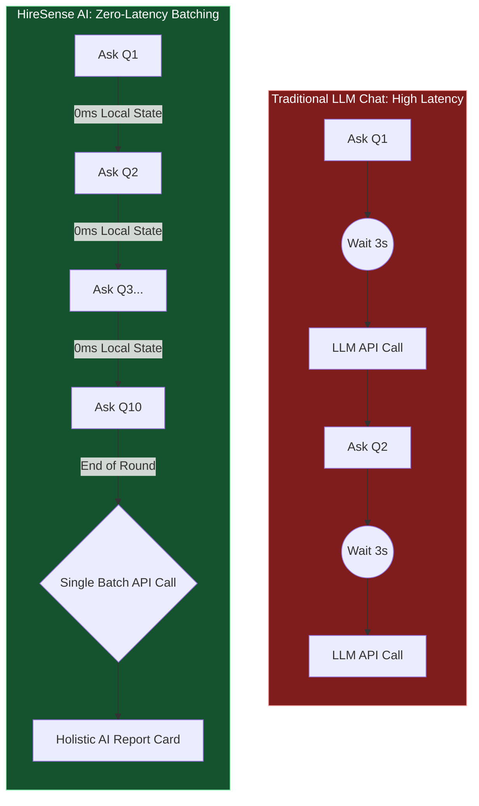

```mermaid
flowchart TD
    subgraph Traditional [Traditional LLM Chat: High Latency]
        direction TB
        T1[Ask Q1] --> T2((Wait 3s)) --> T3[LLM API Call] --> T4[Ask Q2] --> T5((Wait 3s)) --> T6[LLM API Call]
    end

    subgraph HireSense [HireSense AI: Zero-Latency Batching]
        direction TB
        H1[Ask Q1] -->|0ms Local State| H2[Ask Q2] 
        H2 -->|0ms Local State| H3[Ask Q3...]
        H3 -->|0ms Local State| H4[Ask Q10]
        H4 -->|End of Round| H5{Single Batch API Call}
        H5 --> H6[Holistic AI Report Card]
    end

    style Traditional fill:#7f1d1d,stroke:#fca5a5,color:#fff
    style HireSense fill:#14532d,stroke:#86efac,color:#fff
```
