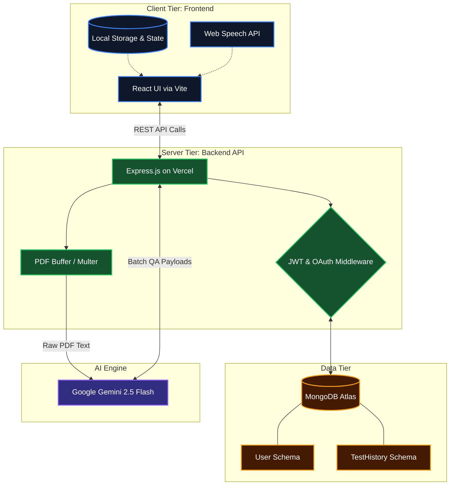

```mermaid
graph TD
    subgraph Client [Client Tier: Frontend]
        UI[React UI via Vite]
        State[(Local Storage & State)]
        Mic[Web Speech API]
    end

    subgraph Server [Server Tier: Backend API]
        Node[Express.js on Vercel]
        Auth{JWT & OAuth Middleware}
        Multer[PDF Buffer / Multer]
    end

    subgraph Database [Data Tier]
        Mongo[(MongoDB Atlas)]
        UserSchema[User Schema]
        TestSchema[TestHistory Schema]
    end

    subgraph External [AI Engine]
        Gemini[Google Gemini 2.5 Flash]
    end

    %% Connections
    UI <-->|REST API Calls| Node
    State -.-> UI
    Mic -.-> UI
    
    Node --> Auth
    Node --> Multer
    
    Auth <--> Mongo
    Mongo --- UserSchema
    Mongo --- TestSchema
    
    Multer -->|Raw PDF Text| Gemini
    Node <-->|Batch QA Payloads| Gemini

    classDef client fill:#0f172a,stroke:#3b82f6,stroke-width:2px,color:#fff;
    classDef server fill:#14532d,stroke:#22c55e,stroke-width:2px,color:#fff;
    classDef db fill:#451a03,stroke:#f59e0b,stroke-width:2px,color:#fff;
    classDef ai fill:#312e81,stroke:#8b5cf6,stroke-width:2px,color:#fff;
    
    class UI,State,Mic client;
    class Node,Auth,Multer server;
    class Mongo,UserSchema,TestSchema db;
    class Gemini ai;
```
