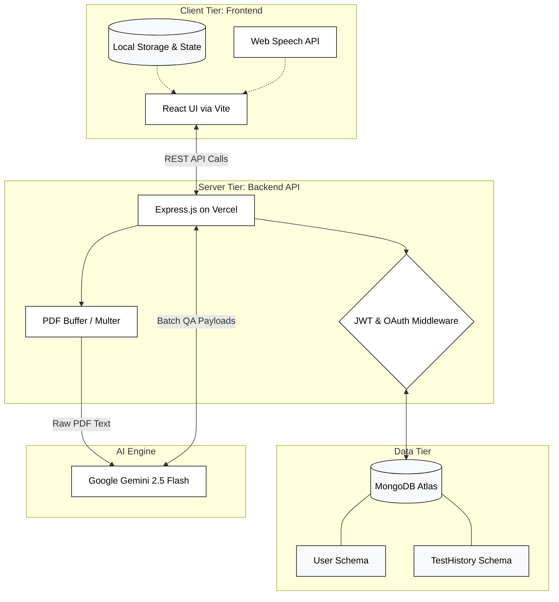

```mermaid
graph TD
    subgraph Client [Client Tier: Frontend]
        UI[React UI via Vite]
        State[(Local Storage & State)]
        Mic[Web Speech API]
    end

    subgraph Server [Server Tier: Backend API]
        Node[Express.js on Vercel]
        Auth{JWT & OAuth Middleware}
        Multer[PDF Buffer / Multer]
    end

    subgraph Database [Data Tier]
        Mongo[(MongoDB Atlas)]
        UserSchema[User Schema]
        TestSchema[TestHistory Schema]
    end

    subgraph External [AI Engine]
        Gemini[Google Gemini 2.5 Flash]
    end

    %% Connections
    UI <-->|REST API Calls| Node
    State -.-> UI
    Mic -.-> UI
    
    Node --> Auth
    Node --> Multer
    
    Auth <--> Mongo
    Mongo --- UserSchema
    Mongo --- TestSchema
    
    Multer -->|Raw PDF Text| Gemini
    Node <-->|Batch QA Payloads| Gemini

    %% Academic Monochrome Styling
    classDef default fill:#ffffff,stroke:#000000,stroke-width:1px,color:#000000;
    classDef db fill:#f8f9fa,stroke:#000000,stroke-width:1px,color:#000000;
    class State,Mongo,UserSchema,TestSchema db;
```
